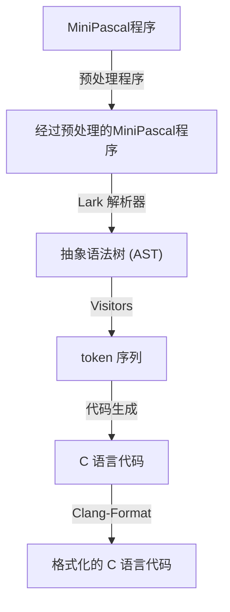

```mermaid
graph TB
	A[MiniPascal程序] -- 预处理程序 --> B
	B[经过预处理的MiniPascal程序] -- Lark 解析器 --> C
	C["抽象语法树 (AST) "] -- Visitors --> D
	D[token 序列] -- 代码生成 --> E
	E[C 语言代码] -- Clang-Format --> F[格式化的 C 语言代码]
```

