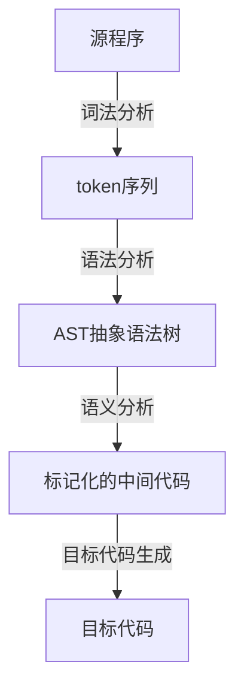

# 系统分析及设计

杨宏琛 李洋

## 设计目标

设计并实现一个 MiniPascal 的编译器，可以按照所给MiniPascal语言的语法，参考Pascal语言的语义，编译程序可以对于源程序进行词法分析、语法分析、语义分析以及错误处理与恢复，并将源程序转换成等价的 C 程序。

## 需求分析

### 数据流图

### 功能说明

#### 预处理

- 删除源代码中的注释
- 统一标识符的大小写
- 生成不包含注释和预处理指令的纯源代码文件

#### 词法分析

- 根据词法约定处理源程序
- 跟踪单词在源程序中的位置信息,用于错误报告
- 返回单词类型码和属性值

#### 语法分析  

- 根据 MiniPascal 文法进行分析
- 构建抽象语法树
- 记录语法分析的其他信息,为后续语义分析做准备

#### 语义分析

- 设计和管理符号表的数据结构和操作(插入、查找、进入作用域、退出作用域等)。
- 类型检查:包括基本类型、数组类型、标识符的类型等。
- 表达式的类型检查。
- 语句的语义检查(如变量是否已定义,赋值语句双方类型是否匹配等)。
- 过程/函数调用的语义检查(参数个数、类型、传递方式是否正确等)。
- 检测并报告语义错误。

#### 代码生成  

- 为 MiniPascal 语言的每个结构(如表达式、语句等)设计与目标语言的对应代码。
- 管理运行时存储区(如符号表信息、临时变量等)。
- 生成目标代码文件。

#### 错误处理

- 在编译的各个阶段检测并报告相应的错误信息。
- 尽可能对错误进行修复,使编译能继续进行。
- 报告错误类型、错误位置等信息。

#### 测试

- 单元测试和集成测试。
- 自动化测试。
- 生成测试报告。

#### 其他  

- 用户界面
- 开发工具和环境
- 文档

### 数据说明

| 数据       | 描述                                                   |
| ---------- | ------------------------------------------------------ |
| 源代码     | 由 MiniPascal 语言撰写的源程序                         |
| 抽象语法树 | 源代码在语法分析阶段生成的树状结构表示                 |
| 符号表     | 存储源程序中定义的变量、常量、过程等符号信息的数据结构 |
| 目标代码   | 最终生成的 C 语言代码                                  |
| 错误记录   | 编译过程中检测到的各种错误信息的记录                   |

## 程序架构设计

整个系统的架构设计遵循经典的编译器设计理论，可分为前端（Front End）、中端优化器（Optimizer）和后端（Back End）三个核心部分。

前端负责源语言分析，包括词法分析、语法分析和语义分析三个阶段。在词法分析阶段，我们利用Lark这一现代化的解析器构造工具，基于正则表达式和上下文无关文法自动构建高效的LALR(1)解析器，对MiniPascal源代码进行词法单元识别和模式匹配。紧接着在语法分析阶段，LALR(1)解析器根据MiniPascal语言的上下文无关文法规则，对词法单元序列进行语法结构分析，生成抽象语法树（AST）表示。

AST抽象化了源代码的语法结构，为后续的语义分析做好准备。在语义分析阶段，我们遍历AST，基于属性文法理论，执行符号解析、类型推导、作用域分析等语义检查，构建精细的符号表数据结构，存储程序中定义的各种符号实体及其属性信息。语义分析产出标注了丰富语义信息的装饰AST。

中端优化器在语义分析的基础上，对装饰AST进行程序分析和转换，生成中间代码表示。中间代码采用静态单赋值形式，方便进行数据流分析和各种编译器优化，如常量传播、公共子表达式消除、死代码消除等。同时，中端优化器还负责管理临时变量的分配和回收。

后端部分的任务是将中间代码转换为高级的C语言程序代码。首先是指令选择阶段，将中间代码的每个操作翻译成对应的C语言语句或表达式。接下来是存储管理，为中间代码中的变量、临时值等分配适当的C语言数据结构，正确管理它们的作用域和生存周期。然后是控制流构建，将中间代码的控制流结构映射为C语言的控制流语句。最后，代码生成阶段综合前面的结果，生成完整、可读的C语言程序文本，包括函数定义、语句、表达式等。在这个过程中，我们需要格外注意各种语言细节，如变量作用域、运算符优先级、函数调用约定等，以确保生成的C代码语义行为与源MiniPascal程序完全等价。

错误处理模块贯穿整个编译过程，负责检测和报告各种语法和语义错误，尽可能对错误进行修复。同时，我们提供了单元测试、集成测试和自动化测试等测试框架，以确保编译器的正确性和可靠性。

总的来说，该编译器系统的架构设计模块化分层、层次分明、彼此协作紧密。从前端的语言分析，到中端的程序优化和转换，再到后端生成高级C语言代码，整个系统有机地协同工作，将MiniPascal源代码高效可靠地转换为等效的C程序，并最大限度地控制了系统复杂度。

## 程序总体功能设计

### 符号表设计

| 符号表属性  | 说明                                            |
| ----------- | ----------------------------------------------- |
| name        | 符号的名称,全为小写                             |
| type        | 符号的数据类型,如整型、实型、布尔型、数组类型等 |
| scope       | 符号的作用域信息,如全局或局部,所属过程等        |
| value       | 对于常量符号,存储其值                           |
| nesting     | 存储符号所在的嵌套层次,如函数嵌套等             |
| isParameter | 标记该符号是否为函数/过程的参数                 |
| paramMode   | 如果是参数,记录其传递方式(值传递或引用传递)     |

### 结构
- 前端:
    - 词法分析器
    - 语法分析器
    - 语义分析器
- 中端优化器
- 后端:  
    - 指令选择
    - 存储管理
    - 控制流构建
    - 代码生成

### 相关函数
略