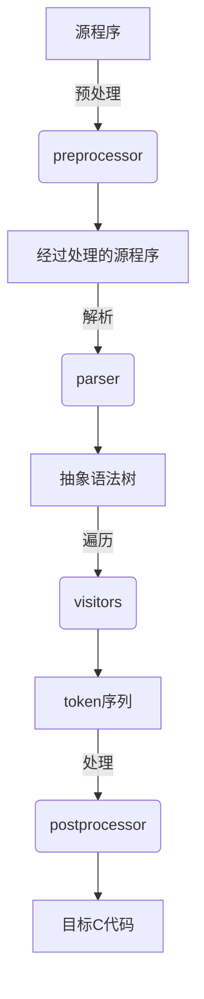

# MiniPascal语言编译程序的设计与实现

## 课程设计任务和目标 

基于MiniPascal语言的语法规则，设计并实现一个完整的编译程序。该编译器能够将 MiniPascal 语言编译为 C 语言。生成的 C 语言程序与 Pascal-S 语言程序面对相同输入的输出结果一致，同时对错误 MiniPascal 程序，可以进行错误处理与错误恢复，提供尽可能详细丰富的报错信息。

## 需求分析

 ### 开发环境

- Python 3.11
- Clang 18
- CustomTkinter

### 额外功能

#### 语法成分

- while loop
- 

#### 数据结构

## 总体设计

### 数据结构设计

#### 数据流图

#### Tree

- **作用**：语法树结构，表示语法规则中的非终结符，可以包含多个子节点，形成树状结构。

- **属性**：

  - `data`：表示当前节点的语法规则名称。

  - `children`：包含当前节点的所有子节点

#### Token

- **作用**：表示语法规则中的终结符，是AST中的叶子节点。
- **属性**：
  - `type`: 表示令牌的类型，如关键字、标识符、常量等。
  - `value`: 令牌的值，字符串。

#### Context

- **作用**：管理符号表和程序上下文，包括变量、常量、类型声明以及函数和过程的定义。
- **实现**：使用`deque`（双端队列）来模拟作用域的栈结构，通过`enter_scope`和`exit_scope`方法来处理不同的作用域。
- **符号表**：由`FunctionSymbol`、`ValueSymbol`和`ArraySymbol`组成，存储了标识符的详细信息。

#### FunctionSymbol

- **作用**：表示程序中的函数或过程，存储函数的元数据和定义。
- **属性**：
  - `name`: 函数的名称。
  - `header`: 函数的声明头，包含返回类型、函数名和参数列表。
  - `tokens`: 函数定义的令牌序列。
  - `parameter_list`: 函数的参数列表，存储参数的类型和名称。
  - `error_message`: 储存 visiting 阶段发现的错误。

#### ValueSymbol

- **作用**：表示程序中的值或变量，存储变量的详细信息。
- **属性**：
  - `name`: 变量的名称。
  - `type`: 变量的类型。
  - `mutable`: 布尔值，指示变量是否可变。
  - `value`: 变量的值，可以是整型、浮点型、布尔型或字符型。

#### ArraySymbol

- **作用**：表示程序中的数组类型，存储数组的维度和类型信息。
- **属性**：
  - `name`: 数组的名称。
  - `type`: 数组的基类型。
  - `dimensions`: 数组的维度信息，存储每个维度的长度和起始索引。

#### Result

- **作用**：封装编译过程的最终结果，包括生成的代码、成功标志、错误信息和错误分析。
- **属性**：
  - `code`: 转换后的代码字符串或错误信息。
  - `success`: 布尔值，指示编译过程是否成功。
  - `error_messages`: 存储编译过程中遇到的错误信息的列表。
  - `error_info`: 通过`code_analyze`函数得到的额外错误分析信息。

### 总体结构设计

基于您提供的代码和要求，以下是编译原理与技术课程设计报告中“总体结构设计”部分的更详细内容：

---

### 2）总体结构设计

#### 功能模块划分

编译器的总体结构被划分为以下几个关键功能模块，每个模块承担编译过程中特定的任务：

1. **预处理器（Preprocessor）**:
   - 负责处理源代码中的注释，移除形如 `{...}` 的注释部分。
   - 将代码转换成小写，为后续的解析过程做准备。

2. **解析器（Parser）**:
   - 使用`Lark`库根据定义的语法规则将预处理后的源代码解析成抽象语法树（AST）。
   - AST是后续语义分析和代码生成的基础。

3. **访问者（Visitor）**:
   - 实现语义分析，通过访问者模式遍历AST。
   - 执行类型检查、作用域分析、符号表管理等语义分析任务。
   - 生成C语言的Token序列，这是源语言到目标语言的直接映射。

4. **后处理器（Postprocessor）**:
   - 对访问者生成的Token序列进行优化和必要的调整。
   - 例如，合并连续的分号，优化表达式格式等。

5. **代码生成器（Code Generator）**:
   - 将后处理器优化后的Token序列转换成格式化的C代码。
   - 使用`clang-format`命令对生成的代码进行格式化，以符合C语言的编码规范。

6. **错误处理器（Error Handler）**:
   - 在编译过程的任何阶段捕获错误，并生成错误报告。
   - 提供错误位置和错误信息，辅助开发者调试和修正源代码。

#### 模块功能

- **预处理器**：执行源代码的预处理任务，为解析阶段提供干净的输入。
- **解析器**：构建AST，它是源代码结构的树状表示。
- **访问者**：在AST上执行深度优先搜索，生成中间代码。
- **后处理器**：对中间代码进行优化，提高代码质量。
- **代码生成器**：将优化后的中间代码转换成目标代码。
- **错误处理器**：处理编译过程中的所有错误，并提供反馈。

#### 模块之间的关系

- **预处理器**与**解析器**：预处理器的输出直接作为解析器的输入。
- **解析器**与**访问者**：解析器生成AST，作为访问者的输入。
- **访问者**与**后处理器**：访问者生成的Token序列传递给后处理器进行优化。
- **后处理器**与**代码生成器**：后处理器输出优化后的Token序列，代码生成器据此生成C代码。
- **错误处理器**：作为一个独立的模块，它与所有其他模块交互，捕获并报告错误。

#### 模块之间的接口

- **预处理器输出**：源代码字符串，去除注释和转换为小写。
- **解析器输出**：AST，表示源代码的结构。
- **访问者输出**：Token序列，是C语言代码的中间表示。
- **后处理器输出**：优化后的Token序列，更加符合C语言的编码风格。
- **代码生成器输出**：格式化后的C代码字符串，可以直接用于编译。
- **错误处理器接口**：接收错误信息，生成错误报告，并提供给用户。

这些模块的设计允许编译器以模块化和高效的方式处理语言的复杂性。通过精心设计的类和函数，我们能够逐步构建出C语言的等价代码，同时确保编译过程的错误能够被准确地捕获和报告。

### 用户接口设计

#### Python Package

#### CLI

#### GUI

## 详细设计

### 语法规则

### Parser

### Visitor

### Context

### 错误处理

#### Parsing 阶段

在 Parsing 阶段

说明，包括：

  接口描述

  功能描述

  所用数据结构说明

  算法描述

## 源程序清单

  注意编程风格，如：

  使用有意义的变量名、程序的缩排、程序的内部注释

## 程序测试

给出测试报告，包括：

1）测试环境

2）测试的功能

3）针对每个功能的测试情况，包括：测试用例、预期的结果、测试结果及其分析

在设计测试计划时，不但要考虑正确的测试用例，还要考虑含有错误的测试用例。

## 课程设计总结

1) 体会/收获（每个成员完成的工作、收获等）
2) 设计过程中遇到或存在的主要问题及解决方案
3) 改进建议